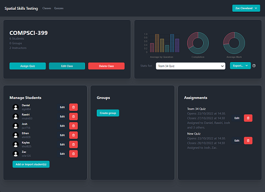
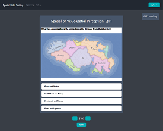
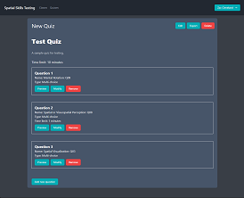

# Spatial Skills Testing Website

Created by Team 34 for COMPSCI 399.

This website allows instructors to create, management, assign and track quizzes for their students.  These quizzes can be used for any subject, but we made it with Spatial Skills testing in mind.  We ensured that individual questions could be timed, and that interactive questions are easily implemented to allow for this.

This is a [Next.js](https://nextjs.org/) project bootstrapped with [`create-next-app`](https://github.com/vercel/next.js/tree/canary/packages/create-next-app).

Our website is hosted at [spatialskills.team34.software](https://spatialskills.team34.software/), and we used the [Jira](https://399-34-14.atlassian.net/jira/software/projects/P14/boards/2/roadmap) project management system.  


## Screenshots
  



## Technologies used

- Server
  - [Next.js](https://nextjs.org/) v12.2.5
  - [NextAuth.js](https://next-auth.js.org/) v4.10.3
  - [Typescript](https://www.typescriptlang.org/)
  - [Prisma](https://www.prisma.io/) v4.5.0
  - [Apollo Server Micro](https://www.npmjs.com/package/apollo-server-micro) v3.10.2
  - [GraphQL](https://graphql.org/)
- Frontend
  - [React](https://reactjs.org/) v18.2.0
  - [TailwindCSS](https://tailwindcss.com/) v3.1.8
  - [HeadlessUI](https://headlessui.com/) v1.6.6
  - [fontawesome](https://fontawesome.com/) v6.1.2
  - [csv-parse](https://www.npmjs.com/package/csv-parse/) v5.3.0
  - [fast-xml-parser](https://www.npmjs.com/package/fast-xml-parser) v4.0.9
  - [formik](https://formik.org/) v2.2.9
  - [Apollo Client](https://www.apollographql.com/apollo-client) v3.6.9
  - [React Markdown](https://github.com/remarkjs/react-markdown) v8.0.3
  - [random-seed](https://www.npmjs.com/package/random-seed) v0.3.0
  - [chart.js](https://www.chartjs.org/) v3.9.1
- Hosting
  - [AWS EC2](https://aws.amazon.com/ec2/)
  - [AWS RDS Database](https://aws.amazon.com/rds/) (Postgres)

## Getting Started

First, download the repo and install all the required packages:

```bash
git clone https://github.com/uoa-compsci399-s2-2022/Website
cd Website
npm install
```

Then, you will need to configure Prisma:

```bash
npx prisma generate
```

Finally, run the development server:

```bash
npm run dev
```

Open [http://localhost:3000](http://localhost:3000) with your browser to access the website.

## Environment Variables

| Name                 | Description                |
| -------------------- | -------------------------- |
| NEXTAUTH_URL         | Base URL for the website   |
| NEXTAUTH_SECRET      | Secret for generating keys |
| DATABASE_URL         | URL to postgres database   |
| GITHUB_ID            | GitHub OAuth ID            |
| GITHUB_SECRET        | GitHub OAuth Secret        |
| GOOGLE_CLIENT_ID     | Google OAuth ID            |
| GOOGLE_CLIENT_SECRET | Google OAuth Secret        |

For local development, you can include these variables in a `.env` file in the root directory.
Here is an example:

```
NEXTAUTH_URL=http://localhost:3000/
NEXTAUTH_SECRET=mydevelopmentkey
...
```

## Future Plans

This website is almost complete, but run out of time for:

- MOODLE question export
- Better statistic exporting
- Comprehensive user testing


In the future, it would be nice to implement:

- More interactive question types
- A safer backend, which does more validation and security checks
- Refractoring.  Cleaner code would make the website easier to maintain
- Extensive statistics, with more graphs!